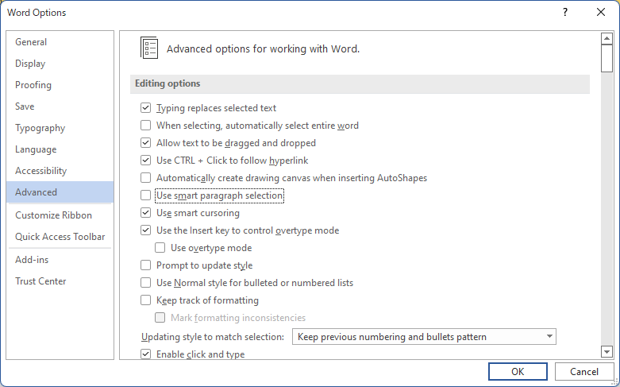

<h1></h1>
<p align="center">
  
  <p align="center">
    <a href="https://scan.coverity.com/projects/pit-ray-win-vind"></a>
    <a href="https://www.codacy.com/gh/pit-ray/win-vind/dashboard?utm_source=github.com&amp;utm_medium=referral&amp;utm_content=pit-ray/win-vind&amp;utm_campaign=Badge_Grade"></a>
    <a href="https://github.com/pit-ray/win-vind/actions/workflows/codeql-analysis.yml"></a>
    <a href="https://github.com/pit-ray/win-vind/actions/workflows/test.yml"></a>
    <br>  
    <a href="https://github.com/pit-ray/win-vind/actions/workflows/coverity.yml"></a>
    <a href="https://github.com/pit-ray/win-vind/actions/workflows/mingw.yml"></a>
    <a href="https://github.com/pit-ray/win-vind/actions/workflows/msvc.yml"></a>
    <br>
    <a href="https://community.chocolatey.org/packages/win-vind"></a>
    <a href="https://github.com/microsoft/winget-pkgs/tree/master/manifests/p/pit-ray/win-vind"></a>
    <a href=""></a>
    
  </p>
</p>  

## What is this?
**win-vind** provides a lightweight hybrid UI system of CUI and GUI for Windows.  
By installing this tool, you will be able to control the Windows GUI in the same way as Vim.

### 1. Vim-user friendly.
All configuration methods and mode concepts are derived from Vim, allowing for Vim-like UI operation.  
Vim users only need to understand win-vind's macro features and additional mode concepts with little learning cost.  

### 2. There are many useful built-in commands.
You don't have to worry about complicated scripts and dependencies like with traditional key binding tools.  
You can freely create user-defined commands by combining low-level optimized built-in commands.

### 3. Very portable and fully open source.
win-vind is a small single binary with no dependencies that runs with user permissions.   
It is also available from the command line as a command for UI operations like `$ win-vind -c "ggyyGp"`.


### Top Feature Demo

<video src="https://user-images.githubusercontent.com/42631247/215270933-3365065b-53db-4eca-9fc6-cd03d13e5ab0.mp4" controls></video>

<br>  

## Installation
We support a variety of installation methods.

### [Chocolatey](https://chocolatey.org/)

```sh
$ choco install win-vind
```

### [winget](https://github.com/microsoft/winget-cli)

```sh
$ winget install win-vind
```

### [scoop](https://scoop.sh/)
Not yet open.
```sh
$ scoop install win-vind
```

### Executable Installer
- [win-vind_5.0.0_32bit_installer.zip](https://github.com/pit-ray/win-vind/releases)
- [win-vind_5.0.0_64bit_installer.zip](https://github.com/pit-ray/win-vind/releases)

### Portable Zip
- [win-vind_5.0.0_32bit_portable.zip](https://github.com/pit-ray/win-vind/releases)
- [win-vind_5.0.0_64bit_portable.zip](https://github.com/pit-ray/win-vind/releases)


## Usage

Usage is mainly described in easy-to-read [documentation pages](https://pit-ray.github.io/win-vind/usage/) with plenty of diagrams.  
Here, only a sample .vindrc is shown below. As you can see, it is Vim user-friendly.  

### .vindrc sample  

```vim
" options
set shell = cmd
set cmd_fontsize = 14
set cmd_fontname = Consolas
set blockstylecaret
set blockstylecaret_mode = solid

" bindings
imap <capslock> {<ctrl>}

inoremap <alt><alt> <easy_click_left>
inoremap <win-enter> <window_resizer>

noremap <ctrl-1> :! gvim<cr>
noremap <ctrl-2> :e http://example.com<cr>

enoremap t ggyyGp
```

## Known Issues
- EasyClick does not seem to work properly for some applications on older Windows 10 before 1803. The cause is not known, but we have confirmed that it works after 1909. ([#11](https://github.com/pit-ray/win-vind/issues/11))
- Windows 10/11 Single Language does not seem to be able to map toggle keys such as `<Capslock>`. ([#40](https://github.com/pit-ray/win-vind/issues/40))

- If you want to use word motion (e.g. `w`, `B`, `e`) in MS Office Word, it is recommended to disable `Use smart paragraph selection`.  

  

## How to build

#### Preparation
The dependencies required for the build are installed locally in the project directory. The system is not affected.
```bash
$ ./tools/setup_libs.bat -msvc 64
```

#### Debug

```bash
$ cmake -B debug -G "Visual Studio 16 2019" .
$ cmake --build debug
$ ./debug/Debug/win-vind.exe
```

#### Release

```bash
$ cmake -B release -DCMAKE_BUILD_TYPE=Release -G "Visual Studio 16 2019" .
$ cmake --build release --config Release
$ ./debug/Release/win-vind.exe
```

If you want to build with MinGW or create an installer, see [here](https://github.com/pit-ray/win-vind/blob/master/CONTRIBUTING.md#to-development).


## Contribute
If you would like to contribute to win-vind, see [CONTRIBUTING.md](https://github.com/pit-ray/win-vind/blob/master/CONTRIBUTING.md).

The project is managed with <a href="https://github.com/users/pit-ray/projects/2">GitHub Projects</a>. 

## Similar Projects
- [rcmdnk/vim_ahk](https://github.com/rcmdnk/vim_ahk)
- [microsoft/PowerToys](https://github.com/microsoft/PowerToys)
- [zsims/hunt-and-peck](https://github.com/zsims/hunt-and-peck)

## License  

This software is provided by pit-ray under the **MIT License**.  
