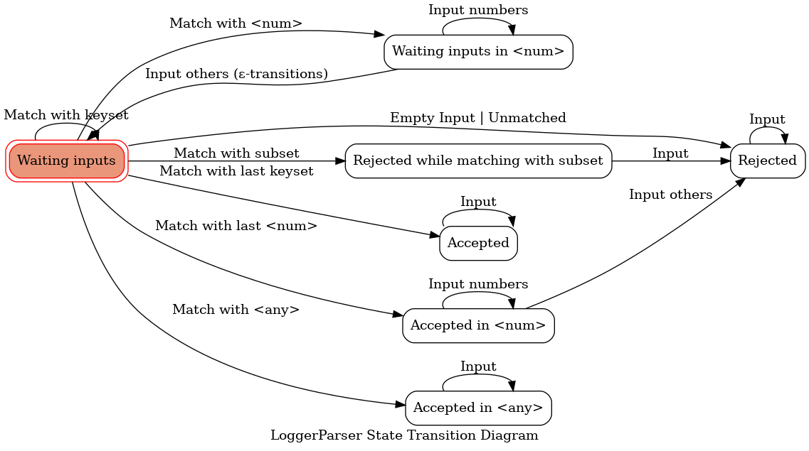
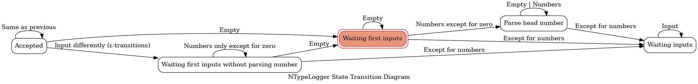

Getting ready now.

# Document for Development

This document describes the high-layer architecture of win-vind. If you would like to contribute, a read will help you understand the files you need to edit.  

## Architecture

### LoggerParser

   

  

### NTypeLogger

