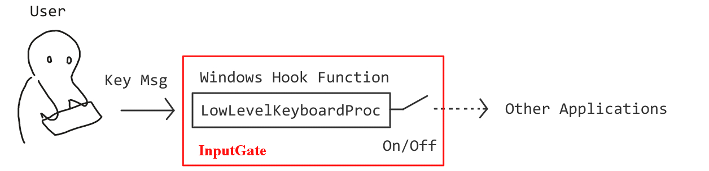
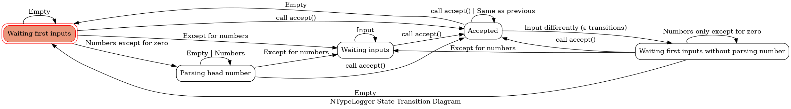
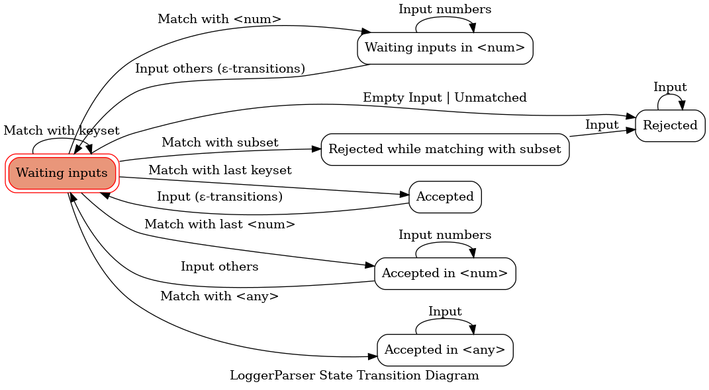
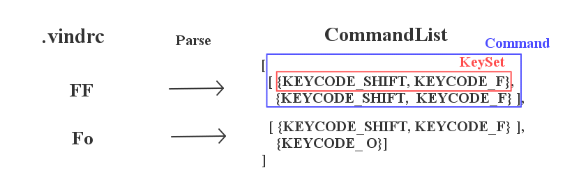
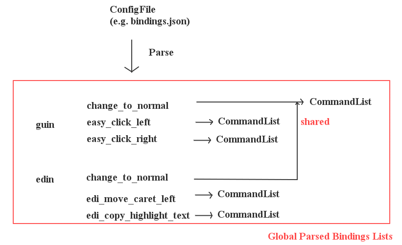

# Architecture

This document describes the high-layer architecture of win-vind.  


# Key Matching System



win-vind hocks the function to capture input messages at low-level events on the operating system. This function is managed by KeyAbsorber. It switches between absorbing a key message and passing it on to other applications.  

The captured inputs are converted into a convenient sequence of keycodes by KeyLogger. Currently, CharLogger and NTypeLogger are typical key loggers. CharLogger logs like general textual inputs, while NTypeLogger parses head numbers (e.g. `2gg`, `3h`) and logs raw keycodes by its automaton.  

The converted sequence logs do matching with the parser per a function to select an appropriate function by FuncFinder. The parser, which is called LoggerParser, is also an automaton.  

Thus, win-vind captures inputs, format to sequence, and match automatonically. The separated phases allow us to reduces the latency and computation costs.  

By the way, the state transition diagrams of the automaton described here are as follows.  

### NTypeLogger


### LoggerParser



<br>  
<br>  


# Data Formats and its Managers
## FuncFinder


FuncFinder is used to select a function that matches the key sequence of the keylogger.  It has an internal array of modes, each of which holds pointers to the LoggerParser of valid functions.  Since LoggerParser is an automaton as described above, it transitions the state of all LoggerParser in the current mode when matching.

And the mode array in FuncFinder is reconstructed each time the settings are loaded for example by Apply button.

The code sample is shown below.

**FuncFinder Sample**
```cpp
NTypeLogger logger ;
FuncFinder finder ;

while(update_background()) {
    if(!NTYPE_LOGGED(logger.logging_state())) {
        continue ;
    }

    if(auto parser = finder.find_parser_with_transition(logger.latest())) {
        if(parser->is_accepted()) {
            parser->get_func()->process(logger) ; // call function
        }
        else if(parser->is_rejected_with_ready()) {
            // It is not accepted, but matched only subsets.
            // For example, if it matched only <ctrl> in <ctrl-f>, skip <ctrl> log.
            logger.remove_from_back(1) ;
            finder.backward_parser_states(1) ;
        }
    }
    else {
        // There is no matched function.
        logger.clear() ;
        finder.reset_parser_states() ;
    }
}
```

<br>  

## LoggerParser
LoggerParser parses the KeyLogger to validate if its sequences satisfy bindings according to the state transition diagram shown above. Internally, each has an associated BindedFunc and a CommandList for comparison as a shared pointer.  

#### BindedFunc
BindedFunc is the base class for all predefined functions in win-vind. Most of the functions are inherited like as below.

```cpp
#ifndef MY_BINDING_HPP
#define MY_BINDING_HPP

#include "bind/base/binded_func_creator.hpp"

namespace vind
{
    struct MyBinding : public BindedFuncCreator<MyBinding> {
        explicit MyBinding() ;
        static void sprocess() ; // oneshot
        static void sprocess(NTypeLogger& parent_lgr) ; // from typing (e.g. `2gg`)
        static void sprocess(const CharLogger& parent_lgr) ; // from command line (e.g. `:abcd`)
    } ;
}

#endif
```

#### CommandList  

  

CommandList is keycode arrays generated from the settings file.  It is generated for each mode of the function, but is shared among modes in a syntax like `"edin": ["<guin>"]` .  




# Authors
This document is written by pit-ray. If you want documents more for development, please requests in Issues.  
